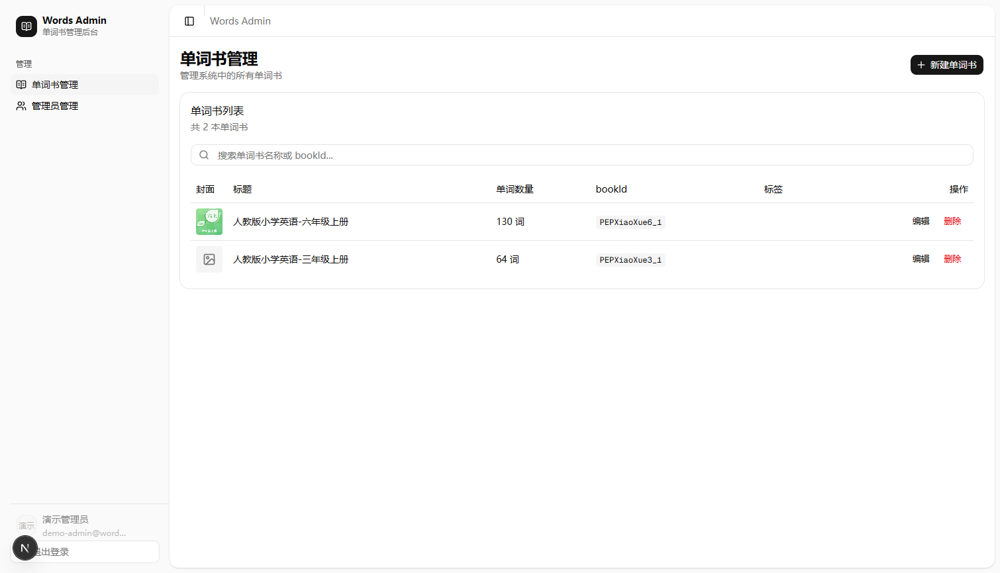
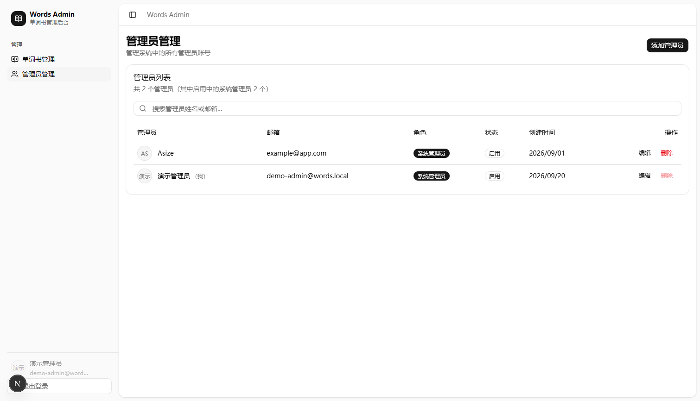

# words-admin

英语单词学习平台的管理后台，负责管理员权限、单词书与词库数据的管理，为后续 H5 学习端提供数据支撑。

技术栈：Next.js 16 (App Router) · React 19 · TypeScript (strict) · Drizzle ORM · PostgreSQL (Supabase) · Tailwind CSS v4 · shadcn/ui

## 项目预览

| 单词书管理 | 管理员管理 |
| --- | --- |
|  |  |

> 演示账号：`demo-admin@words.local` / `demo123456`（系统管理员）

## 功能

### 管理员与权限

- 注册 / 登录 / 登出 / 会话查询，密码使用 bcrypt 哈希存储
- 服务端 Session：随机 token 存入数据库，通过 httpOnly Cookie 下发，有效期 7 天；登录时顺带清理已过期会话
- 两级角色：`system_admin` 系统管理员 / `admin` 普通管理员；管理员管理类接口统一经过 `requireSystemAdmin` 守卫（401 未登录 / 403 无权限）
- 账号启用 / 禁用：被禁用的管理员会话立即失效（会话校验时拦截）
- 首个管理员引导：数据库中无任何管理员时，首页自动跳转注册页引导创建系统管理员

### 单词书管理

- 单词书的创建、编辑、删除与搜索
- `bookId` 唯一性校验（重复返回 409）
- 支持封面图、词数统计与标签字段

### 数据清洗与导入

开源词库（JSONL 格式）通过 [scripts/jsonl-to-csv.js](./scripts/jsonl-to-csv.js) 转换为 CSV（含引号/逗号/换行的转义处理），再批量导入 PostgreSQL 的 `words` 表。词库数据体积较大，不入 Git 仓库，由脚本从源数据按需生成。

## 数据库设计

Schema 定义在 [lib/db/schema](./lib/db/schema)（Drizzle ORM，Schema 即代码）：

| 表 | 说明 |
| --- | --- |
| `admin_users` | 管理员：姓名、邮箱（唯一）、密码哈希、角色枚举、状态枚举 |
| `admin_sessions` | 会话：token（唯一）、用户外键（级联删除）、过期时间 |
| `books` | 单词书：标题、`book_id`（唯一）、词数、封面、标签 |
| `words` | 单词：词序、词条、`content` JSON（音标、释义、例句、短语）、所属词书 |

迁移方式：修改 schema 后执行 `npm run db:generate` 生成迁移文件，`npm run db:push` 同步到数据库，`npm run db:studio` 可视化查看数据。

## API

| 方法 | 路径 | 说明 | 权限 |
| --- | --- | --- | --- |
| POST | `/api/auth/signup` | 注册管理员 | 公开（仅首个系统管理员）/ 系统管理员 |
| GET | `/api/auth/signup` | 查询是否已存在管理员（首管引导） | 公开 |
| POST | `/api/auth/signin` | 登录，下发会话 Cookie | 公开 |
| POST | `/api/auth/signout` | 登出并销毁会话 | 登录用户 |
| GET | `/api/auth/session` | 获取当前登录用户信息 | 登录用户 |
| GET / POST | `/api/admin-users` | 管理员列表 / 新建管理员 | 仅系统管理员 |
| PATCH / DELETE | `/api/admin-users/[id]` | 修改角色、状态 / 删除管理员 | 仅系统管理员 |
| GET / POST | `/api/books` | 单词书列表 / 新建单词书 | 仅系统管理员 |
| PATCH / DELETE | `/api/books/[id]` | 编辑 / 删除单词书 | 仅系统管理员 |

## 目录结构

```
words-admin/
├── app/
│   ├── (auth)/            # 登录、注册页
│   ├── (admin)/           # 管理后台（侧边栏布局）：books、admin-users
│   ├── api/               # Route Handlers：auth、admin-users、books
│   └── page.tsx           # 入口重定向（无管理员 → 注册引导）
├── components/
│   ├── app-sidebar.tsx    # 后台侧边栏导航
│   └── ui/                # shadcn/ui 组件（按需引入）
├── lib/
│   ├── auth.ts            # 会话创建/校验/销毁（server-only）
│   ├── admin-guard.ts     # requireSystemAdmin 统一 API 守卫
│   ├── auth-context.tsx   # 前端用户上下文
│   └── db/                # Drizzle 连接与 schema
├── drizzle/               # 生成的迁移文件
└── scripts/               # 数据清洗脚本
```

## 快速开始

```bash
npm install
```

在项目根目录创建 `.env.local`：

```
DATABASE_URL=<Supabase PostgreSQL 连接串>
```

初始化数据库并启动：

```bash
npm run db:push    # 将 schema 同步到数据库
npm run dev        # http://localhost:3000
```

首次访问会引导注册首个系统管理员，之后即可登录进入后台。
