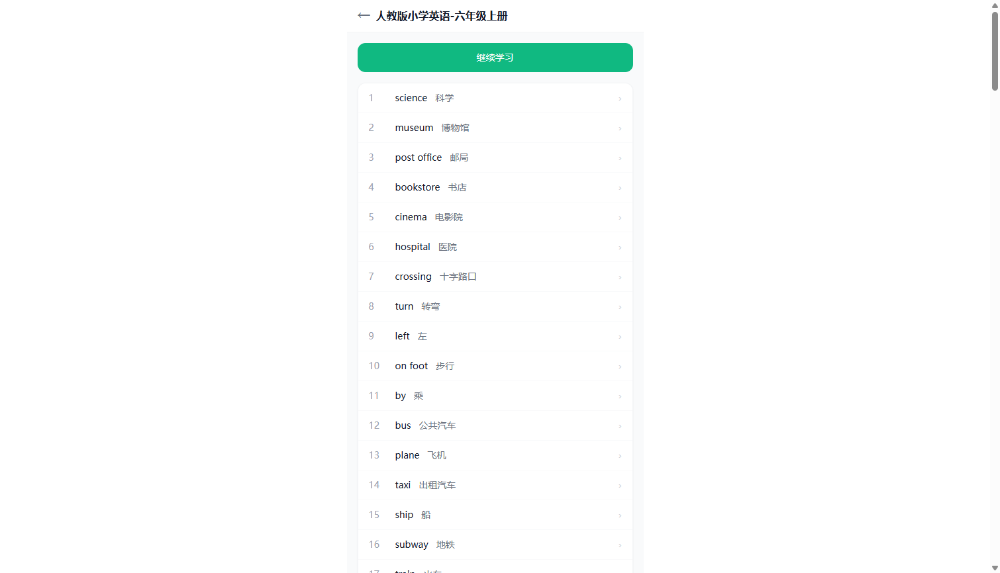
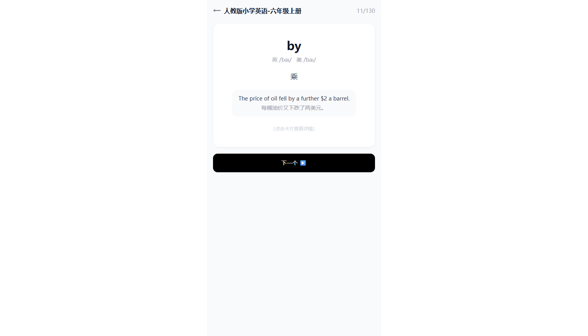
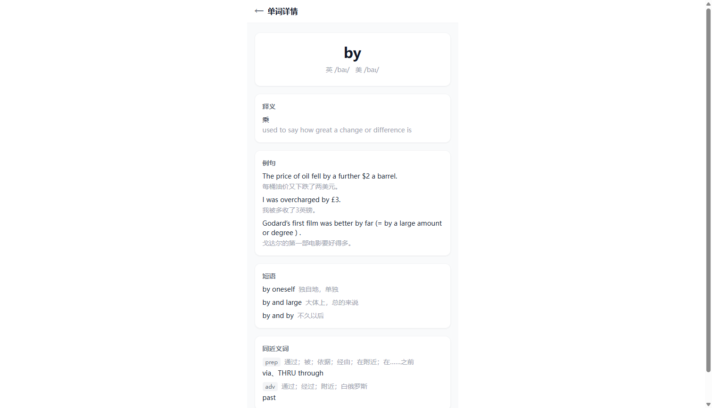
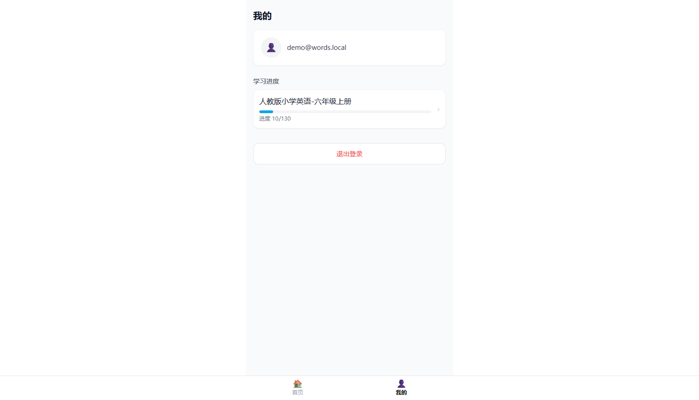

# words-h5

英语单词学习平台的 H5 移动端学习应用：浏览单词书、卡片式背单词、学习进度自动同步。单词书数据由 [words-admin](../words-admin) 管理端维护，两端共用同一 Supabase PostgreSQL 数据库。

技术栈：Next.js 14 (App Router) · NextAuth v5 · React 18 · TypeScript · Drizzle ORM · Supabase PostgreSQL

## 项目预览

| 首页（书单 + 最近学习） | 单词书详情 |
| --- | --- |
|  |  |

| 卡片学习（音标/释义/例句） | 单词详情 | 我的（学习进度） |
| --- | --- | --- |
|  |  |  |

> 演示账号：`demo@words.local` / `demo123456`

## 功能

- **单词书浏览**：首页书单 + 最近学习卡片，未登录点击单词书自动引导登录（携带回跳地址）
- **卡片式学习**：大字单词 + 英美音标 + 释义 + 例句（例句缺失降级短语），点卡片进入单词详情
- **进度同步**：点击【下一个】实时保存进度（`study_progress` 表，用户+词书唯一）；学习中刷新页面回到原地；学完一轮自动回绕复习
- **单词详情**：释义、例句、短语、同近义词（按词性分组）、同根词、记忆方法，模块缺失自动隐藏
- **登录/注册**：底部弹层双 Tab，邮箱密码注册即登录；学习类路由由中间件设卡，其余页面放行由交互层控制

## 数据库

复用 words-admin 建立的 `books` / `words` 表，本端新增 `study_progress` 表（首次使用时自动建表兜底，无需手动迁移）：

| 表 | 说明 |
| --- | --- |
| `books` / `words` | 复用管理端表结构（列名为带引号的驼峰标识符，由 Drizzle 自动处理） |
| `study_progress` | 学习进度：`user_id` + `book_id` 唯一，记录 `last_word_rank`，按 `updated_at` 排序 |

数据导入：词书源数据（NDJSON）通过 [scripts/import-words.ts](./scripts/import-words.ts) 导入（`npx tsx scripts/import-words.ts`，幂等可重跑）。

## 快速开始

在项目根目录创建 `.env`：

```
POSTGRES_URL=<Supabase PostgreSQL 连接串>
AUTH_SECRET=<openssl rand -base64 32 生成>
```

启动：

```bash
npm install
npm run dev   # http://localhost:3000
```

## 目录结构

```
words-h5/
├── app/
│   ├── (tabs)/            # 底部双 Tab：首页（书单/最近学习）、我的（进度/退出）
│   ├── book/[bookId]/     # 单词书详情（单词列表）
│   ├── study/[bookId]/    # 卡片学习页（登录设卡）
│   ├── word/[id]/         # 单词详情页
│   ├── components/        # BottomNav / AuthPopup / StudyClient / 详情模块
│   ├── actions.ts         # Server Actions：登录/注册/存进度/退出
│   ├── auth.config.ts     # NextAuth 配置（中间件授权 + session 透传 userId）
│   ├── auth.ts            # Credentials Provider
│   └── db.ts              # Drizzle schema 与查询（含学习卡片投影）
├── middleware.ts          # 仅对 /study/* 设卡
├── scripts/import-words.ts
└── e2e-check.mjs          # 端到端验收脚本（登录→学习→进度→回绕）
```

## 验收

```bash
node e2e-check.mjs
```

脚本会创建测试用户并走完登录、页面渲染、进度写入、起点定位、学完回绕、详情渲染的完整链路，结束后自动清理测试数据（需 dev server 运行中）。
